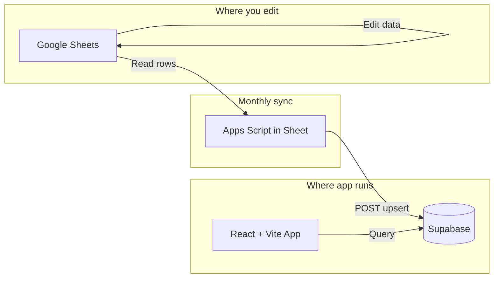

# Travel Planner v2 - Supabase Migration Plan

## Scope: Completely Separate App

This plan builds a **new app** that does not modify your existing setup:


| What              | Status                                                                                 |
| ----------------- | -------------------------------------------------------------------------------------- |
| **Existing code** | Untouched. `digital-nomad-planner.html`, `js/`, `functions/`, `index.html` stay as-is. |
| **Existing site** | Keeps working. Current deployment and Sheets integration remain unchanged.             |
| **New app**       | Built in a **separate folder** (e.g. `travel-planner-v2/` or sibling to this project). |
| **Build**         | Develop locally first (`npm run dev`); deploy only when ready.                         |
| **Target URL**    | `travelplanner.kimbersykes.com` (when you host it later).                              |


**Sheets**: The sync script adds a new menu item **Sync to Supabase** in your existing Apps Script project. It does not change sheet structure, formulas, or data. It only reads and pushes a copy to Supabase. Your current app continues to read from Sheets via Cloudflare Functions until you switch.

---

## Dev Workflow Rules (Apply Throughout)

**Server management:**
- Always **close any existing running dev servers** (e.g. `npm run dev`, `wrangler pages dev`) before starting a new one
- Check terminals for running processes; stop with Ctrl+C before launching

**Browser verification:**
- **Open or refresh the browser** when new updates are reflected (e.g. after starting dev server, after UI changes, after routing updates)
- Use `http://localhost:5173` (Vite default) or the port shown in the terminal

**Supabase CLI access:** Supabase CLI is installed globally via Scoop. Cursor has automated access to `supabase` commands (login, link, db push/pull, etc.). Project ref: `xaxbbtzsyrtchtjrjvqy`. Credentials in `.env.local`.

---

## Your Requirements Summary

- **Supabase** as the app's database (primary data store)
- **Google Sheets** remains where you and Siona edit data
- **Sheets to Supabase sync** when you edit (~once a month max)
- **Modern free stack** - React + Vite + Supabase
- **Usage**: 2 users, ~10 min/week max
- **Primary platform**: PWA on Android and iPhone (mobile-first)

---

## PWA and Mobile-First Foundation

Based on your answers, the app will be built as a **mobile-first PWA** with:


| Requirement                        | Implementation                                                                                                              |
| ---------------------------------- | --------------------------------------------------------------------------------------------------------------------------- |
| **Install to home screen**         | Web App Manifest with `display: standalone` (full-screen, no browser bar)                                                   |
| **Works on both Android + iPhone** | Standard PWA APIs; test on both; iOS needs `apple-mobile-web-app-capable` meta tag                                          |
| **Bottom nav on mobile**           | Responsive layout: bottom nav bar on viewport &lt; 768px, top/side tabs on desktop                                          |
| **Offline (nice to have)**         | Service worker: cache static assets; cache Supabase data in IndexedDB; show cached data when offline, sync when back online |
| **No push notifications**          | Skip for v1; can add later if desired                                                                                       |


### PWA Checklist (Core Files)

- `manifest.json` – name, short_name, icons (192x192, 512x512), theme_color, background_color, display: standalone, start_url
- `sw.js` (service worker) – cache app shell + static assets; optionally cache API responses for offline
- Meta tags in HTML – `apple-mobile-web-app-capable`, `apple-mobile-web-app-status-bar-style`, viewport
- HTTPS – required for PWA; Cloudflare Pages provides this

### Routes and Pages

Each section and sub-section has its own URL for shareable links and back/forward navigation:


| Route                 | Section | Sub-section  |
| --------------------- | ------- | ------------ |
| `/` or `/us`          | Us      | (none)       |
| `/past/all-time`      | Past    | All Time     |
| `/past/relationship`  | Past    | Relationship |
| `/past/map`           | Past    | Map          |
| `/present/to-book`    | Present | To Book      |
| `/present/booked`     | Present | Booked       |
| `/future/scenarios`   | Future  | Scenarios    |
| `/future/bucket-list` | Future  | Bucket List  |


**Default sub-sections**: `/past` redirects to `/past/all-time`; `/present` to `/present/to-book`; `/future` to `/future/scenarios`.

### Sub-Menu (Above Bottom Nav)

When the user is in Past, Present, or Future, a **sub-menu** appears above the bottom nav to toggle between sub-sections:

```mermaid
flowchart TB
    subgraph MainContent [Main content area]
        Content[Page content]
    end
    subgraph NavArea [Fixed bottom area]
        SubMenu[Sub-menu: All Time | Relationship | Map]
        BottomNav[Bottom nav: Us | Past | Present | Future]
    end
    Content --> SubMenu
    SubMenu --> BottomNav
```


- **Us**: No sub-menu (section has no sub-sections).
- **Past**: Sub-menu with All Time | Relationship | Map.
- **Present**: Sub-menu with To Book | Booked.
- **Future**: Sub-menu with Scenarios | Bucket List.

The sub-menu is shown only when a section with sub-sections is active. It sits immediately above the bottom nav, with clear visual separation. On desktop, sub-tabs can appear as a horizontal bar under the section header instead of above the nav.

### Mobile UX Priorities

- **Touch targets**: Minimum 44x44px for taps (Apple/Google guidelines)
- **Bottom nav**: Us, Past, Present, Future – always visible, easy to reach one-handed
- **Map**: Ensure Leaflet pinch-zoom and pan work well; consider `touch-action` CSS if needed
- **Forms**: Adequate input size, avoid zoom-on-focus issues (`font-size: 16px` on inputs)
- **Safe areas**: Respect notch/home indicator via `env(safe-area-inset-*)`

### Offline Strategy (Nice to Have)

1. **Static assets**: Cache-first in service worker (JS, CSS, icons, fonts)
2. **Data**: On app load, fetch from Supabase; store in IndexedDB via a lightweight cache layer
3. **When offline**: Read from IndexedDB; show "Offline – showing cached data" banner; retry sync when online
4. **Write offline**: Queue mutations locally; sync when back online (optional, adds complexity – can defer to v2)

---

## Tech Stack Recommendation


| Component       | Recommended                               | Why                                                                                    |
| --------------- | ----------------------------------------- | -------------------------------------------------------------------------------------- |
| **Frontend**    | React + Vite                              | Simpler than Next.js for a SPA; no SSR complexity; fast builds                         |
| **Database**    | Supabase                                  | Postgres, free tier generous for 2 users, good DX                                      |
| **Hosting**     | Cloudflare Pages (current) or Vercel      | Both free; you already use Cloudflare                                                  |
| **Sheets Sync** | Google Apps Script in your existing Sheet | Free, no extra services; add a menu button or monthly trigger to push data to Supabase |


**Next.js vs plain React (Vite)**: Next.js adds SSR, API routes, and deployment complexity you don't need. For a SPA used by 2 people weekly, **React + Vite** is simpler and sufficient.

**Alternatives considered**:

- **Firebase** - Similar free tier, but Supabase's Postgres + SQL is more flexible for your tabular sheet structure
- **Turso / Neon** - Good alternatives, but Supabase includes Auth + Realtime + Storage in one place
- **Pipedream / n8n for sync** - Work but add another service; Apps Script in your Sheet is free and self-contained

---

## Important: Supabase Free Tier and Low Usage

Supabase **pauses free projects after 7 days of inactivity**. With ~weekly use, you risk hitting that.

**Mitigation**: Add a simple **GitHub Actions cron** (or Vercel Cron / external ping) that runs every 5–6 days and performs a lightweight Supabase query. This keeps the project active at no cost. (I can include this in the plan.)

---

## Data Flow (New Architecture)




1. **You edit** in Google Sheets (as now).
2. **Monthly (or on demand)**: Run a sync from the Sheet (menu item or trigger) → Apps Script reads all sheets → pushes to Supabase via REST API.
3. **App reads** only from Supabase; no direct Sheets access in production.

---

## Supabase Schema (Maps to Current Sheets)

Your existing sheets map cleanly to Supabase tables:


| Sheet                    | Supabase Table               | Key Columns (from [ARCHITECTURE.md](ARCHITECTURE.md))                                    |
| ------------------------ | ---------------------------- | ---------------------------------------------------------------------------------------- |
| Profiles                 | `profiles`                   | profile_id, full_name, dob, passport_*, us_visa_*, frequent_flyer_*                      |
| Countries                | `countries`                  | country_name, iso3, iso2                                                                 |
| RelationshipLog          | `relationship_log`           | date, kimber_country, siona_country, notes, ks_uk_work_days, ss_uk_work_days             |
| Statistics               | `statistics`                 | country, country_code, kimber_days, siona_days, together_days, total_days, etc.          |
| PresentBookings          | `present_bookings`           | booking_id, profile_id, type, sub_type, start_date, end_date, country, city, details     |
| FutureScenarios          | `future_scenarios`           | scenario_id, headline, created_by, rating, start, end, summary, icon, accommodation_type |
| ScenarioStays            | `scenario_stays`             | scenario_id, stay_id, profile_scope, country, city, start_date, end_date, notes          |
| ToBook                   | `to_book`                    | task_id, assignee, booking_type, start_date, end_date, instructions                      |
| BookedUpcoming           | `booked_upcoming`            | booking_id, type, dates, travellers, details                                             |
| BookingTypeMeta          | `booking_type_meta`          | type, icon, color                                                                        |
| VisaRules                | `visa_rules`                 | rule_id, jurisdiction, window_days, max_days, contiguous_territory, notes                |
| PreRelationshipCountries | `pre_relationship_countries` | profile_id, country_name, visited_before                                                 |
| BucketList               | `bucket_list`                | id, user, country, icon, description, notes, completed                                   |


`Statistics` can remain computed (Apps Script or Supabase function) or be derived from `relationship_log` at runtime; your current setup suggests keeping a computed table for performance.

---

## Implementation Phases (Chronological Order)

### Phase 0: Scaffold and Copy (Do First)

1. **Scaffold** – Create React + Vite app in `TravelPlanner_v2/`
2. **Copy script** – Add `scripts/copy-from-v1.cjs` to pull reference files and assets from v1 (DESIGN_SYSTEM, ARCHITECTURE, APPLICATION_SUMMARY, assets, `digital-nomad-planner.html` → `reference/`). Exclude `assets/cursor/`
3. **Run copy** – `npm run copy-from-v1` or `node scripts/copy-from-v1.cjs`

### Phase 1: Supabase Setup and Schema

1. Create Supabase project (free tier).
2. Define tables matching the sheet structure above.
3. Enable RLS (Row Level Security); for 2 users with password gate, you can start with permissive policies and tighten later.
4. Run initial migration: one-time script to load existing Sheet data into Supabase (Apps Script export + import, or manual CSV import).

### Phase 2: Sheets-to-Supabase Sync (Apps Script)

1. Add a new script in your existing Google Apps Script project.
2. Use `UrlFetchApp.fetch()` to call Supabase REST API (`/rest/v1/<table>`).
3. For each sheet:
  - Read all rows (skip header).
  - Map columns to table columns.
  - Use Supabase upsert (POST with `Prefer: resolution=merge-duplicates` or PATCH for updates).
4. Add a custom menu in Sheets: **Travel Planner → Sync to Supabase**.
5. Optionally: time-based trigger (e.g. 1st of month) to run sync automatically.

Existing reference: [googleSheetSyncToSupabase](https://github.com/jairodriguez/googleSheetSyncToSupabase) and [Tektiqua tutorial](https://tektiqua.com/2023/07/11/sync-google-sheets-to-supabase-tutorial/).

### Phase 3: React PWA Foundation

1. **PWA setup** (do early for solid base): `manifest.json` (standalone display, icons 192/512, theme colors), service worker (`vite-plugin-pwa` or Workbox), meta tags (`apple-mobile-web-app-capable`, `apple-mobile-web-app-status-bar-style`, viewport). Test install on Android (Chrome) and iPhone (Safari Add to Home Screen).
2. **Dependencies** – `@supabase/supabase-js`, `react-router-dom`, `leaflet`/`react-leaflet`, `lottie-react`, `vite-plugin-pwa`. Add `lucide-react` later when replacing dummy icons.
3. **Routing** – `react-router-dom` with routes (e.g. `/past/all-time`, `/present/booked`). Redirect `/past` to `/past/all-time`, etc.
4. **Layout** – App shell with main content area, **sub-menu** above bottom nav when in Past/Present/Future, **bottom nav** (Us, Past, Present, Future; 44px touch targets).
5. **Icon component** – Dummy placeholder `<Icon name="..." />` for layout.

**Checkpoint:** Close any running servers, start `npm run dev`, open/refresh browser at `http://localhost:5173`, verify routing and nav.

### Phase 4: Port UI and Data Layer

1. **Port UI** from [digital-nomad-planner.html](digital-nomad-planner.html) into React components:
  - Section shells: UsPage, PastPage, PresentPage, FuturePage
  - Sub-section pages: PastAllTime, PastRelationship, PastMap; PresentToBook, PresentBooked; FutureScenarios, FutureBucketList
  - Ensure touch targets ≥ 44px, inputs ≥ 16px (avoid zoom)
2. **Data layer** – Supabase client; optional: IndexedDB cache for offline read
3. **Password gate** – same as current (simple check before main app).

**Checkpoint:** Refresh browser after each major page/component; verify data loads from Supabase.

### Phase 5: Map (Natural Earth 110m)

1. Use Natural Earth 110m GeoJSON (not local 14MB file)
2. Add `getCountryIds()` helper for property mapping
3. Kosovo overlay (separate GeoJSON if needed)
4. Test Leaflet zoom/pan on mobile

**Checkpoint:** Refresh browser; test map rendering and country matching.

### Phase 6: Deployment and Keep-Alive

1. Deploy React app to **Cloudflare Pages** (or Vercel). Target custom domain: `travelplanner.kimbersykes.com` (configure when you host). Build output: `dist/`.
2. Add GitHub Actions workflow (or equivalent) to ping Supabase every 5–6 days:
  - e.g. `GET https://<project>.supabase.co/rest/v1/...?limit=1` with anon key.
3. Document: how to run sync from Sheets, how to redeploy, env vars.

---

## Excel Export / Sheet Structure

You referenced [Travel Planner - Digital Nomad.xlsx](c:\Users\kimbe\Downloads\Travel Planner - Digital Nomad.xlsx). The schema above is based on the documented sheets in [ARCHITECTURE.md](ARCHITECTURE.md) and [APPLICATION_SUMMARY.md](APPLICATION_SUMMARY.md). When implementing:

- Use the **first row of each sheet as headers** to map column names.
- If the Excel export differs (e.g. extra sheets, renamed columns), adjust the Apps Script sync and Supabase schema accordingly.

---

## What Stays the Same

- **Google Sheets** as the editing interface.
- **Cloudflare Pages** (or similar) for hosting.
- **Password protection** (simple shared password).
- **Feature set**: profiles, visa tracking, map, timeline, bookings, scenarios, bucket list.
- **Design system** (colors, typography) from [DESIGN_SYSTEM.md](DESIGN_SYSTEM.md).

## What Changes

- **Data source**: Sheets (read by app) → Supabase (app reads from here).
- **Write path**: App currently writes via Apps Script → App writes to Supabase; Sheets updates only via manual sync.
- **Stack**: Monolithic HTML/JS → React + Vite + Supabase.
- **Icons**: Replace all current SVGs with dummy placeholders (then Lucide); use a central `Icon` component for easy swap.

---

## Effort Estimate


| Phase                                 | Effort    |
| ------------------------------------- | --------- |
| Supabase schema + initial data load   | 1–2 hours |
| Apps Script sync (all sheets)         | 2–3 hours |
| React app port (4 tabs)               | 1–2 days  |
| PWA manifest + service worker         | 1–2 hours |
| Mobile layout + bottom nav            | 2–4 hours |
| Routes + sub-menu above bottom nav    | 2–3 hours |
| Copy script (scripts/copy-from-v1.js) | ~30 min   |
| Offline cache (nice to have)          | 2–3 hours |
| Icon component + dummy placeholders   | ~1 hour   |
| Deploy + keep-alive                   | ~1 hour   |


**Testing**: Budget time to test on both an Android phone and iPhone (Add to Home Screen, offline behavior, map gestures). iOS note: Safari PWAs need `apple-touch-icon`, and `100vh` can behave oddly – use `dvh` (dynamic viewport) or `min-height: 100dvh` where needed.

---

## Icon Strategy (Placeholder → Lucide)

All icons will be replaced. Use **dummy placeholder icons** during implementation; you will swap to **Lucide** (`lucide-react`) later.

### Implementation Approach

1. **Central Icon component** – `<Icon name="us" size={24} />` – single entry point for all icons.
2. **Dummy phase** – Placeholder renders a simple gray circle/square (or generic SVG) per `name`. Keeps layout correct.
3. **Lucide phase** – Swap the Icon component to import from `lucide-react` and map `name` to Lucide components.

### Icon Inventory (for Lucide mapping later)


| Category          | Current name(s)                                                                                                                        | Suggested Lucide                                                                                                               |
| ----------------- | -------------------------------------------------------------------------------------------------------------------------------------- | ------------------------------------------------------------------------------------------------------------------------------ |
| **Nav tabs**      | us, past, present, future                                                                                                              | Users, Map, CalendarDays, Plane                                                                                                |
| **UI**            | passport, calendar, countries, allTime, top5                                                                                           | FileKey, Calendar, Globe, History, Star                                                                                        |
| **Booking types** | flight, ferry, train, hireCar, accommodation, travelHub                                                                                | Plane, Ship, Train, Car, Hotel, MapPin                                                                                         |
| **Scenario**      | adventure, beach, camping, dining, hiking, mountains, nature, resort, roadtrip, snowboarding, sunny, tropical, vineyard, silversprings | Mountain, Waves, Tent, UtensilsCrossed, Footprints, MountainSnow, Trees, Palmtree, Car, Snowflake, Sun, PalmTree, Wine, MapPin |
| **Accommodation** | VanFrito, VanTutu, AirBNB, Hotel, house                                                                                                | Car, Car, Home, Hotel, Home                                                                                                    |


### Code Pattern (easy Lucide swap)

```jsx
// Dummy phase – components/Icon.jsx
const PLACEHOLDER_ICON = <svg viewBox="0 0 24 24" fill="currentColor"><circle cx="12" cy="12" r="8" /></svg>;

export function Icon({ name, size = 24, ...props }) {
  return <span style={{ width: size, height: size }} {...props}>{PLACEHOLDER_ICON}</span>;
}

// Lucide phase – replace with:
// import * as LucideIcons from 'lucide-react';
// const LucideIcon = LucideIcons[ICON_MAP[name] || 'Circle'];
// return <LucideIcon size={size} {...props} />;
```

This keeps icon usage consistent so swapping to Lucide is a single file change plus a mapping table.

---

## Map and Country Borders - Recommended Approach

You had trouble with borders in the original build. Here's the situation and best path forward.

### Current Setup (Issues)


| Issue                    | Detail                                                                                                                    |
| ------------------------ | ------------------------------------------------------------------------------------------------------------------------- |
| **File size**            | Local GeoJSON ~14MB – too large for world view at zoom 2, slow on mobile                                                  |
| **Data source mismatch** | Local uses `name`, `ISO3166-1-Alpha-3`; remote `datasets/geo-countries` uses `ADMIN`, `ISO_A3` – different property names |
| **Kosovo**               | Local GeoJSON has Kosovo with `ISO3166-1-Alpha-3: "-99"` – matching by ISO fails; you patch with `addKosovoGeoJSON`       |
| **Scale vs use**         | 14MB GeoJSON is high-detail (10m); at zoom 2 a simpler dataset is enough                                                  |
| **Antimeridian**         | Russia, Fiji can have polygon/coordinate issues in Leaflet                                                                |


### Recommended: Natural Earth 110m GeoJSON

Use **Natural Earth 110m** (`ne_110m_admin_0_countries.geojson`) for the world map.


| Benefit        | Why                                                                             |
| -------------- | ------------------------------------------------------------------------------- |
| Smaller file   | ~1–2MB vs 14MB – faster load on mobile                                          |
| Right scale    | 110m is for world view; 10m is for zoomed regions                               |
| Cleaner shapes | Fewer points, fewer border glitches                                             |
| Stable source  | [nvkelso/natural-earth-vector](https://github.com/nvkelso/natural-earth-vector) |


**URL**: `https://raw.githubusercontent.com/nvkelso/natural-earth-vector/master/geojson/ne_110m_admin_0_countries.geojson`

**Properties**: `NAME` or `ADMIN`, `ISO_A3`, `ISO_A2` (Natural Earth format).

### Kosovo Handling

Natural Earth 110m does not include Kosovo. Keep a separate Kosovo GeoJSON overlay (as you do now) and render it after the main layer.

### Unify Property Mapping

Introduce one place that normalizes GeoJSON properties, e.g.:

```js
function getCountryIds(feature) {
  const p = feature.properties || {};
  return {
    iso3: (p.ISO_A3 || p.ADM0_A3 || p['ISO3166-1-Alpha-3'] || '').toString().replace(/-99/, ''),
    iso2: (p.ISO_A2 || p['ISO3166-1-Alpha-2'] || '').toString().replace(/-99/, ''),
    name: (p.NAME || p.ADMIN || p.name || '').toString().trim()
  };
}
```

Use this for matching Statistics/Countries sheet data (ISO3/ISO2/name) to GeoJSON features.

### Alternative: react-simple-maps (SVG)

If you want a simpler map in the React version:

- **react-simple-maps**: SVG-based, supports TopoJSON, no Leaflet
- TopoJSON ~80% smaller; shared borders reduce visual glitches
- Good for choropleth/visit coloring
- No tiles or zoom/pan like Leaflet; different interaction model

**Recommendation**: Keep Leaflet for familiarity and zoom/pan. Switch to Natural Earth 110m GeoJSON and a unified property mapper.

### Implementation Checklist

1. Replace local GeoJSON with Natural Earth 110m (fetch from URL or bundle ~1–2MB)
2. Add `getCountryIds()`-style helper and use it for all GeoJSON matching
3. Keep `addKosovoGeoJSON` overlay for Kosovo
4. If antimeridian issues appear (e.g. Russia), apply coordinate wrapping (add 360 to negative lons when crossing date line)
5. For React migration: reuse same GeoJSON + Kosovo overlay with Leaflet or evaluate react-simple-maps if you prefer SVG

---

## Optional Simplification: Skip React

If you prefer minimal change, you could:

- Keep the existing HTML/JS app.
- Swap the data layer: replace `/api/sheets` with Supabase client calls.
- Add the Apps Script sync as above.

This reduces migration effort but keeps the current structure (large HTML file, manual JS). React + Vite improves maintainability and component reuse for future changes.